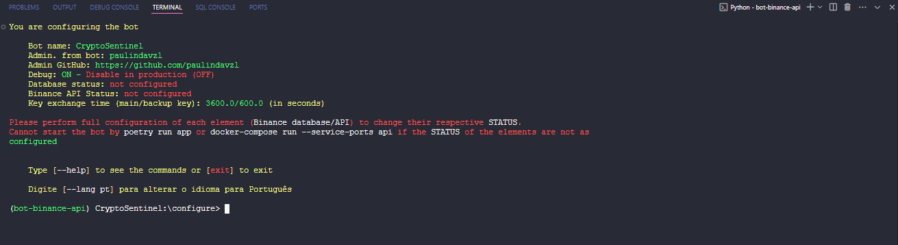
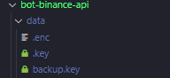
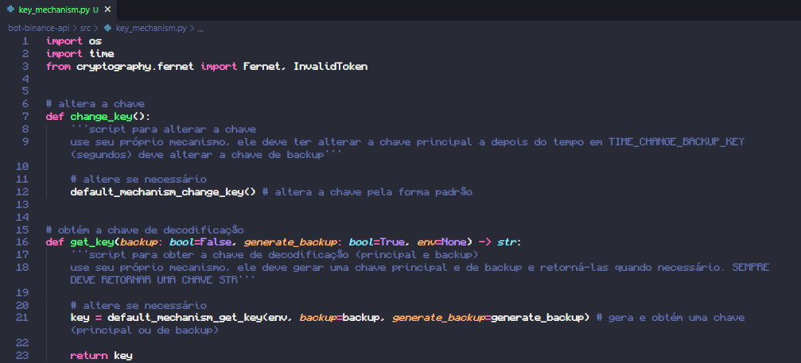

# CryptoSentinel

CryptoSentinel é uma API e bot desenvolvido para conectar-se à [Binance](https://binance.com/) e realizar operações automatizadas em criptomoedas. Ele foi projetado para ser seguro, flexível e fácil de configurar, mesmo para iniciantes.

## Dependências

O **Flask** é uma dependência que é instalada automaticamente, mas caso você não tenha o **Poetry**, **Docker** ou **MySQL** (caso execute localmente), veja como instalá-los clicando em seus logos acima.

## Funcionalidades

Esta API/bot conta com diversas funcionalidades que facilitam sua implementação, manuntenção e personalização:

### Prompt próprio

A API tem um prompt de comandos que facilita a sua configuração, com o usuário podendo definir o Banco de Dados (MySQL) e a chaves de API para conexão com a Binance:

O prompt possui uma versão em `português` e `inglês`. Veja [comandos](docs/COMMANDS.md).

### Facilidade de personalização

Por meio do prompt de configuração é possível personalizar informações do bot, estas são acessadas por [endpoints](docs/ENDPOINTS.md) e ficam visíveis na interface WEB (em desenvolvimento). Veja [comandos](docs/COMMANDS.md).

### Segurança

As chaves de APIs, informações dos banco de dados e outras informações ficam salvas em variáveis de ambiente criptografadas.

O usuário pode definir um mecanismo para proteger as chaves (AWS) modificando duas funções em:

Veja [segurança](docs/SECURITY.md)

## Documentação

- [Guia de instalação](docs/INSTALL.md)
- [Guia de comandos](docs/COMMANDS.md)
- [Guia de configuração](docs/CONFIGURATION.md)
- [Guia de endpoints](docs/ENDPOINTS.md)
- [Segurança](docs/SECURITY.md)
